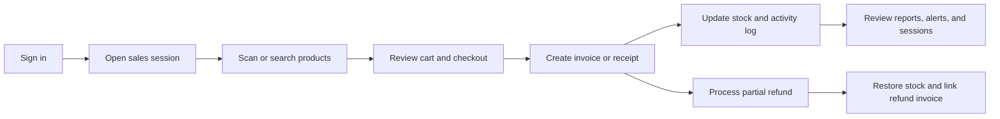
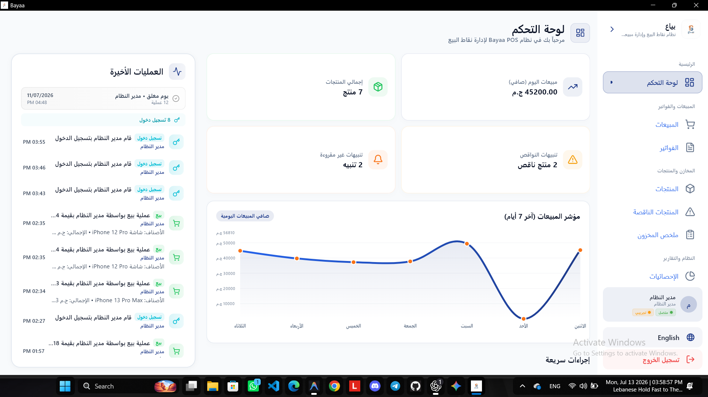
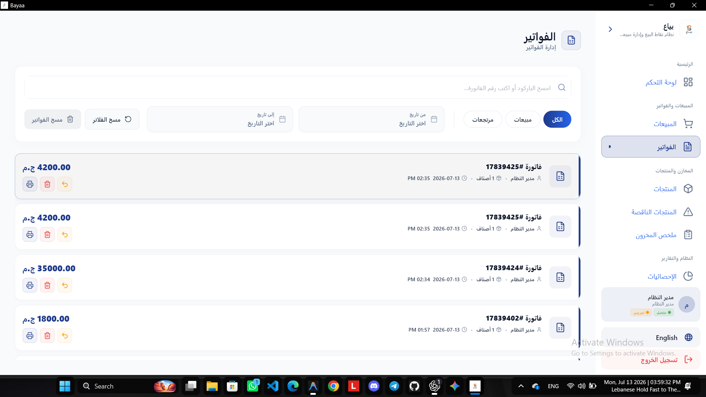
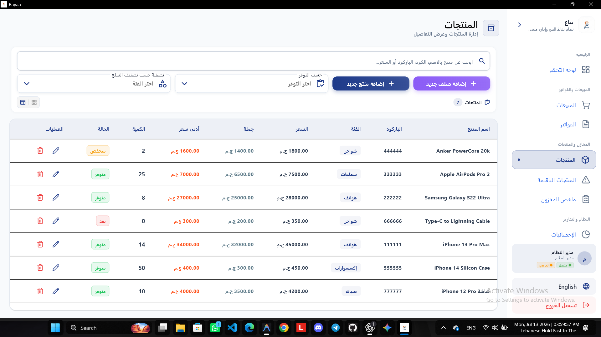
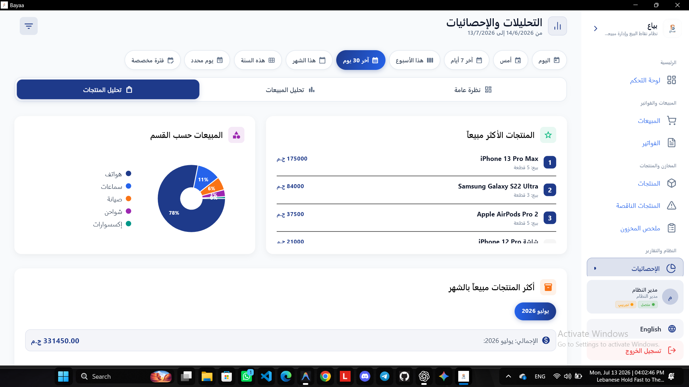
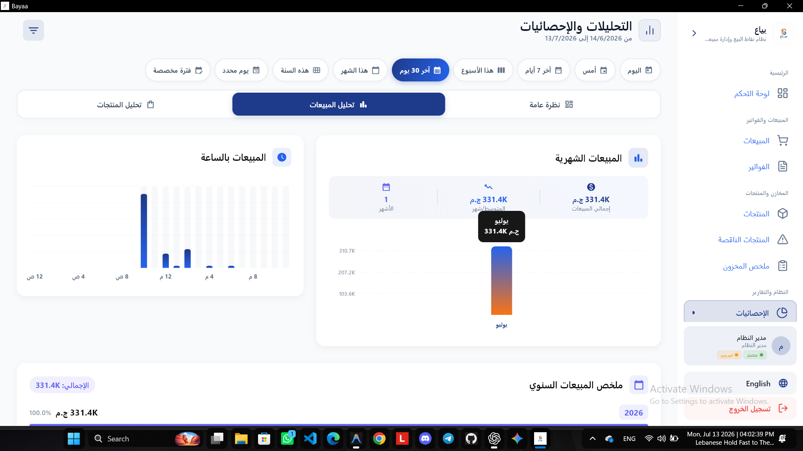
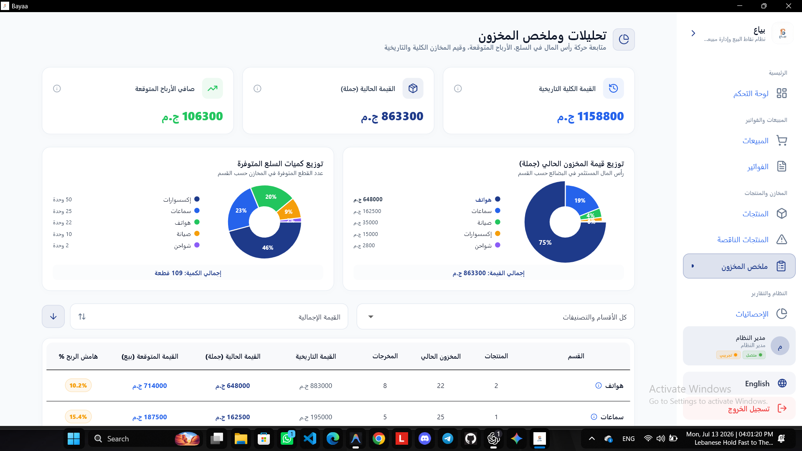
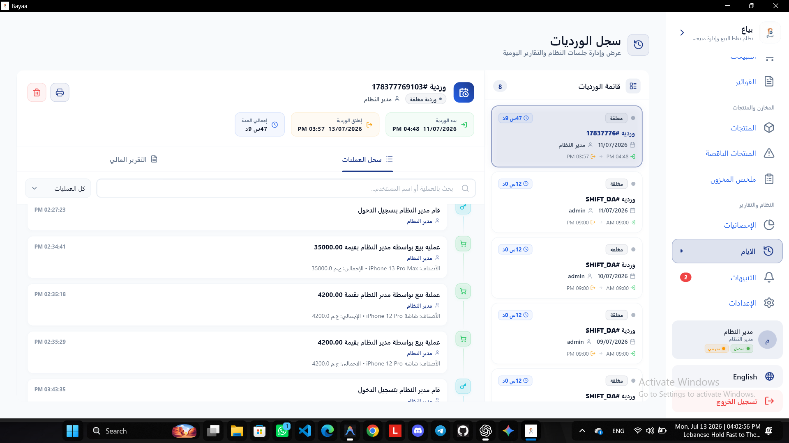
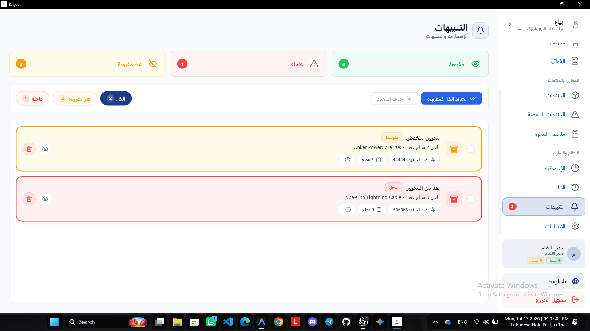
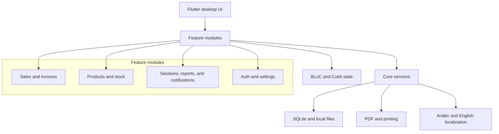

<p align="center">
  
</p>

<h1 align="center">Bayaa POS</h1>

<p align="center">
  <strong>An offline-first point-of-sale and retail-management desktop application.</strong>
</p>

<p align="center">
  
  
  
  
</p>

## Overview

Bayaa POS is a Flutter desktop application for retail businesses that need dependable checkout, stock control, invoices, refunds, reporting, and user access management—without relying on an internet connection or external server.

The application stores its data locally in SQLite, supports Arabic and English interfaces, and is designed for fast day-to-day work at the counter.

## Contents

- [Highlights](#highlights)
- [Product workflow](#product-workflow)
- [Core capabilities](#core-capabilities)
- [Roles and permissions](#roles-and-permissions)
- [Screenshots](#screenshots)
- [Technology](#technology)
- [Architecture](#architecture)
- [Data and reliability](#data-and-reliability)
- [Getting started](#getting-started)

## Highlights

- **Offline-first** — sales and inventory data remain on the local machine.
- **Fast checkout** — barcode scanner support, product search, cart editing, and price validation.
- **Arabic and English** — localized UI with right-to-left support for Arabic.
- **Role-based access** — separate Manager and Cashier capabilities.
- **Invoices and refunds** — A4 invoices, 80 mm receipts, partial refunds, and stock restoration.
- **Operational visibility** — sales, profit, inventory, notifications, sessions, and audit history.

## Product workflow



## Core capabilities

| Area | What it provides |
| --- | --- |
| Sales | Barcode or manual product lookup, cart management, quantity control, price validation, and checkout. |
| Invoices | Searchable invoice history, PDF preview, printing, A4 invoices, and 80 mm thermal receipts. |
| Refunds | Item-level partial refunds linked to their original invoice, with automatic stock restocking. |
| Inventory | Product and category management, stock levels, restocking, low-stock alerts, and stock valuation. |
| Reports | Daily reports, sales and refund analysis, top products, session history, and stock summaries. |
| Administration | User roles, store information, backup and restore, activity logging, and application settings. |

## Roles and permissions

| Capability | Manager | Cashier |
| --- | :---: | :---: |
| POS checkout and invoice viewing | ✓ | ✓ |
| Partial refunds | ✓ | ✓ |
| Product management | ✓ | ✓ |
| Stock alerts and notifications | ✓ | ✓ |
| Invoice deletion and bulk deletion | ✓ | — |
| Reports, analytics, and session history | ✓ | — |
| User management and data backup/restore | ✓ | — |

## Screenshots

| Login | Sales workspace |
| :---: | :---: |
|  |  |

| Dashboard | Invoice management |
| :---: | :---: |
|  |  |

| Inventory | Daily reporting |
| :---: | :---: |
|  |  |

| Sales analytics | Stock summary |
| :---: | :---: |
|  |  |

| Sessions | Low-stock notifications |
| :---: | :---: |
|  |  |

More application views are available in the [`Screenshots`](Screenshots) directory.

## Technology

| Concern | Technology |
| --- | --- |
| Desktop framework | Flutter and Dart |
| State management | BLoC / Cubit (`flutter_bloc`) |
| Local storage | SQLite (`sqflite_common_ffi`) |
| Dependency injection | GetIt |
| Documents | `pdf` and `printing` |
| Analytics visualizations | `fl_chart` |
| Desktop window controls | `window_manager` |
| Localization | Flutter localization with Arabic RTL support |

## Architecture

The codebase uses a feature-first structure with shared infrastructure in `core` and business capabilities grouped by feature.



```text
lib/
├── main.dart                 Application startup and desktop configuration
├── core/                     Shared infrastructure
│   ├── components/           Reusable UI components
│   ├── constants/            Colors, defaults, and shared constants
│   ├── data/                 SQLite, persistence, backup, and shared models
│   ├── di/                   Dependency injection configuration
│   ├── error/                Failure and error-handling utilities
│   ├── localization/         Locale selection and translation helpers
│   │   └── l10n/             Arabic and English localization resources
│   ├── logging/              Application and crash logging
│   ├── security/             Permission checks
│   ├── services/             Shared operational services
│   ├── session/              Shift and active-session management
│   ├── state/                Cross-feature state synchronization
│   ├── theme/                Application theme
│   └── utils/                General utilities
├── features/
│   ├── activation/           Application activation
│   ├── auth/                 Login, users, and roles
│   ├── dashboard/            Navigation shell and dashboard
│   ├── invoice/              Invoice history, printing, and refunds
│   ├── notifications/        Low-stock notifications
│   ├── products/             Product and category management
│   ├── sales/                Checkout, cart, and barcode workflows
│   ├── sessions/             Shift history and daily reports
│   ├── settings/             Store settings, users, and data management
│   ├── stock/                Stock alerts and restocking
│   ├── stock_summary/        Stock valuation and summaries
│   └── analytics/            Sales analytics and visual reports
```

### Design principles

- **Feature-first organization** keeps each business capability easy to locate and evolve.
- **Cubit and BLoC state management** keeps UI state predictable and reactive.
- **Repository and service layers** isolate persistence, backup, printing, and operational logic.
- **Local-first persistence** keeps checkout and inventory workflows available without a server.
- **Localization and RTL** are treated as application-wide behavior, not a screen-specific add-on.

## Data and reliability

Bayaa POS creates and maintains its SQLite database locally. It includes backup and restore support, checkpointing, and an activity log for operational events such as sales, refunds, restocks, user activity, and session changes.

Main data groups include store settings, users, products, categories, shifts, sales, sale items, and activity logs.

## Getting started

### Prerequisites

- Windows 10 or later
- Flutter SDK compatible with Dart `^3.6.1`
- Visual Studio 2022 with the **Desktop development with C++** workload

### Run locally

```bash
git clone https://github.com/Desha29/Bayaa.git
cd Bayaa
flutter pub get
flutter run -d windows
```

On first launch, choose a safe location for the application data. Bayaa POS creates and manages its local data files there.

### Build a release

```bash
flutter build windows --release
```

The Windows release is created under:

```text
build/windows/x64/runner/Release/
```

### Verify changes

```bash
flutter analyze
flutter test
```

For UI changes, also run the Windows application and verify both English and Arabic layouts.

## Contributing

1. Fork the repository.
2. Create a focused branch.
3. Make and verify your changes.
4. Open a pull request with a clear description of the change.

## License

This project is proprietary software. All rights reserved.

<p align="center">
  Built with Flutter by <a href="https://github.com/Desha29">Desha29</a>
</p>
